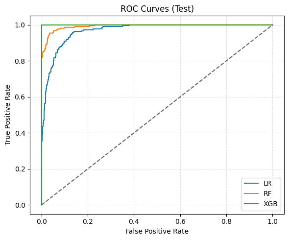
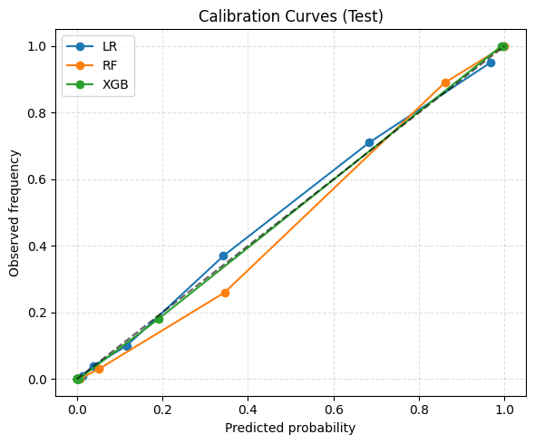
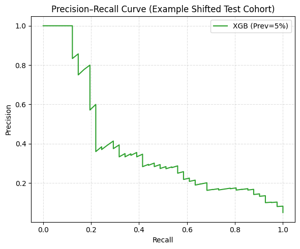

# Probabilistic Machine Learning & Decision Optimization for HCC Diagnosis

**MSc Thesis Reproducibility Repository — Athanasios D. Bisdas (2026)**

> An end-to-end research workflow that connects **calibrated probabilistic machine learning** with **decision-theoretic threshold optimization** for Hepatocellular Carcinoma (HCC) diagnosis.

**Program:** M.Sc. in Business Administration, Analytics and Information Systems, Department of Economics, National and Kapodistrian University of Athens  
**Supervisor:** Frago Kourandi

[Thesis PDF](docs/Athanasios_Bisdas_MSc_Thesis.pdf) · [Presentation PDF](docs/Athanasios_Bisdas_Thesis_Presentation.pdf)

---

## Research question

A high-performing classifier does not automatically define a good clinical decision rule. This thesis studies the full chain from:

1. **risk estimation** with probabilistic machine-learning models,
2. **probability calibration and robustness evaluation**, to
3. **actionable decision thresholds** derived from explicit clinical or economic utilities.

The central idea is that the operating threshold should be treated as a **policy parameter determined by consequences and stakeholder preferences**, not as a default model constant such as 0.50.


## Dataset

The project uses a **fully synthetic, medically realistic** liver-cancer classification dataset with:

- **5,000 observations**
- **14 variables**
- **21.8% positive cases**
- demographic, lifestyle, medical-history and biomarker features

Source: Kaggle — *Predict Liver Cancer from & Clinical Features*  
https://www.kaggle.com/datasets/miadul/predict-liver-cancer-from-and-clinical-features

The Kaggle data card identifies the dataset as **CC0 1.0**. No real patient data are used.

## Methodology

### Part I — Probabilistic machine learning

- Stratified **60% / 20% / 20%** train / validation / test split
- Leakage-safe preprocessing with imputation, encoding and scaling
- Models:
  - Logistic Regression
  - Random Forest
  - XGBoost
- 5-fold cross-validation and hyperparameter tuning
- Evaluation beyond ROC-AUC:
  - Average Precision / PR-AUC
  - Brier score
  - calibration curves
- Post-hoc calibration selection using validation Brier score
- Robustness diagnostics:
  - label permutation
  - repeated splits
  - AFP / Liver Function Score feature ablation
  - numerical noise injection
  - low-prevalence shift

### Part II — Decision optimization

Calibrated probabilities are converted into decisions with a Pauker-Kassirer style expected-utility threshold model.

Six decision scenarios are evaluated across:

- **Clinical utility (QALYs)**
- **Economic utility (cost-benefit analysis)**
- balanced, conservative and aggressive risk attitudes

Sensitivity analyses examine how the optimal threshold changes with:

- RAF — Risk Aversion Factor
- IAF — Intervention Aversion Factor
- OM — Overuse Multiplier

## Selected results

| Result | Value |
|---|---:|
| Baseline XGBoost test ROC-AUC | 1.0000 |
| Baseline XGBoost Average Precision | 1.0000 |
| Baseline XGBoost Brier score | 0.0013 |
| XGBoost ROC-AUC after dropping AFP + LFS | 0.9362 |
| XGBoost AP after dropping AFP + LFS | 0.8580 |
| Decision-threshold range across six reference scenarios | **1.4% - 73.5%** |

The near-perfect baseline performance must **not** be interpreted as clinical readiness. The dataset is synthetic, and the thesis explicitly treats it as a controlled environment for methodological demonstration. Performance degrades materially under stress tests, and external validation on real-world clinical data would be required before any clinical use.

<p align="center">
  
  
  
</p>

## Repository structure

```text
.
├── README.md
├── CITATION.cff
├── requirements.txt
├── RIGHTS_AND_LICENSING.md
├── data/
│   ├── README.md
│   └── synthetic_liver_cancer_dataset.csv
├── docs/
│   ├── Athanasios_Bisdas_MSc_Thesis.pdf
│   └── Athanasios_Bisdas_Thesis_Presentation.pdf
├── notebooks/
│   ├── 01_exploratory_data_analysis.ipynb
│   ├── 02_model_selection_and_calibration.ipynb
│   ├── 03a_stress_test_drop_afp.ipynb
│   ├── 03b_stress_test_drop_lfs.ipynb
│   ├── 03c_stress_test_drop_afp_and_lfs.ipynb
│   ├── 04_noise_injection_and_prevalence_shift.ipynb
│   └── 05_operational_decision_report.ipynb
├── assets/
│   ├── github-social-preview.png
│   ├── test_roc_curve.png
│   ├── test_calibration_curve.png
│   └── robust_pr_curve.png
└── outputs/
    └── README.md
```

## Reproduce the notebooks

The notebook metadata indicates **Python 3.12**. A simple local environment can be created with:

```bash
python -m venv .venv
```

Activate the environment, then install dependencies:

```bash
pip install -r requirements.txt
jupyter lab
```

Open the notebooks in numerical order. They resolve paths whether Jupyter is launched from the repository root or from `notebooks/`.

## Notebook guide

| Notebook | Purpose |
|---|---|
| `01_exploratory_data_analysis.ipynb` | Dataset structure, missingness, distributions, associations and EDA |
| `02_model_selection_and_calibration.ipynb` | Model comparison, tuning, calibration and test evaluation |
| `03a_stress_test_drop_afp.ipynb` | Feature ablation: AFP |
| `03b_stress_test_drop_lfs.ipynb` | Feature ablation: Liver Function Score |
| `03c_stress_test_drop_afp_and_lfs.ipynb` | Joint biomarker ablation |
| `04_noise_injection_and_prevalence_shift.ipynb` | Deployment-oriented robustness simulations |
| `05_operational_decision_report.ipynb` | Threshold application, escalation rates and operational metrics |

## Limitations

This repository is an **academic research artifact**, not a medical device or clinical decision-support system.

Key limitations include synthetic data, lack of external clinical validation, sensitivity to dataset and prevalence shift, simplified utility assumptions, and the need for additional interpretability/fairness analysis before any patient-facing application.

## Citation

If this repository supports academic work, please cite the MSc thesis. GitHub can expose the preferred citation automatically through `CITATION.cff`.

## Rights and licensing

See [`RIGHTS_AND_LICENSING.md`](RIGHTS_AND_LICENSING.md). The dataset has its own CC0 terms; no project-wide open-source license is granted by this repository package.
